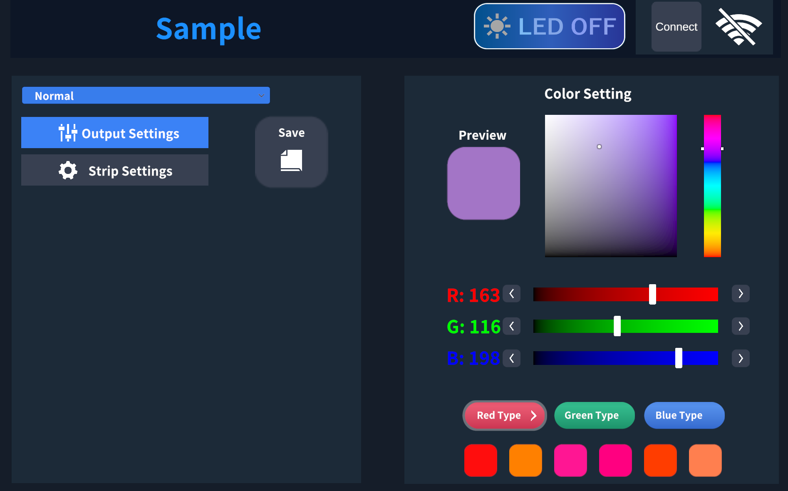
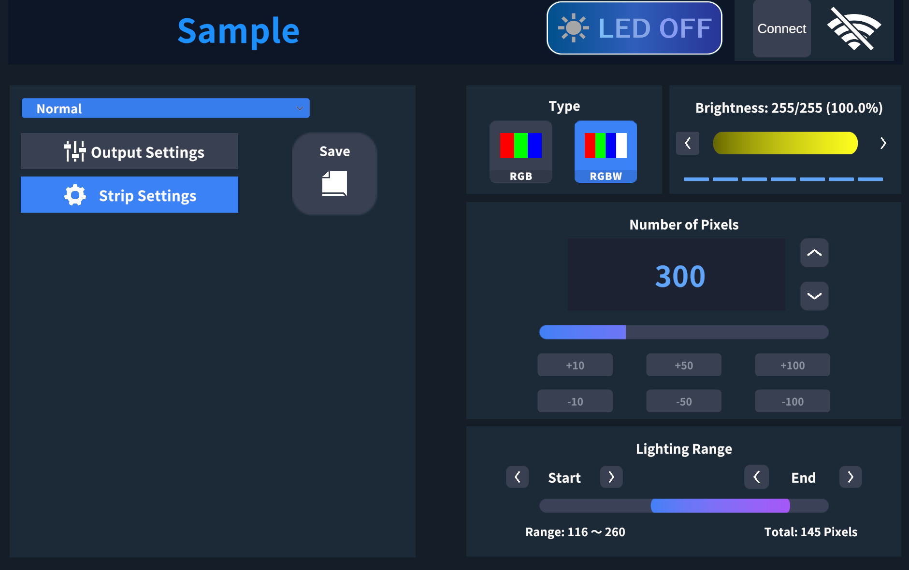

# 💡 Unity LED Strip Controller (UDP)

Unity で制作した **リアルタイム LED ストリップ制御ツール** です。ゲームオブジェクトの色やエフェクトをそのまま LED へ反映させたり、シーケンスを作ってショーとして再生することができます。

---

## 🚀 主な機能

| 機能カテゴリ              | 説明                                                |
| ------------------- | ------------------------------------------------- |
| 🎨 **ライブカラー送信**     | Unity 上で選択したカラーを即時に LED へ反映（HSV または RGB スライダー UI） |
| 🌈 **フェード & エフェクト** | グラデーション、パルス、レインボーなど多数の演出をプリセット                    |
| 🗄 **プリセット管理**      | JSON でプリセット保存・読み込み（ドラッグ & ドロップ対応）                 |

---

## 🎀 UI / UX へのこだわり

* **ダークテーマ UI**：暗所でもまぶし過ぎず、色の再現性が高い配色設計
* **HSV カラーホイール + 数値入力**：直感操作と精密指定を両立
* **ビットマスク選択 UI**：最大 16 本のストリップをトグルスイッチで瞬時に切替
* **アニメーション付きトグル & スライダー**：DOTween で滑らかな操作フィードバック
* **ImGui オーバーレイデバッグ**：送信 FPS / レイテンシ / ドロップ率をリアルタイム表示

---

## 💪 使用技術

* **Unity 2022 LTS**（URP）
* **C# / UniTask** – 非同期送信＆UI制御
* **DOTween** – エフェクト／UI アニメーション
* **UDP** (`System.Net.Sockets.UdpClient`)
* **Newtonsoft.Json** – プリセット保存

---

## 🖼 サンプル画像

### 色調整画面

### 設定変更画面

---

## 🖼️ 実際の動画 (サンプル)
* お手数ですがMovieフォルダ内にある動画をダウンロードしてご覧ください。

---

## 👤 制作：Naoya Nakagawa

* 📧 Email: [nakagawa.naoya.xr@gmail.com](mailto:nakagawa.naoya.xr@gmail.com)
* 🧑‍💻 GitHub: [@NaoyaNakagawa0124](https://github.com/NaoyaNakagawa0124)
