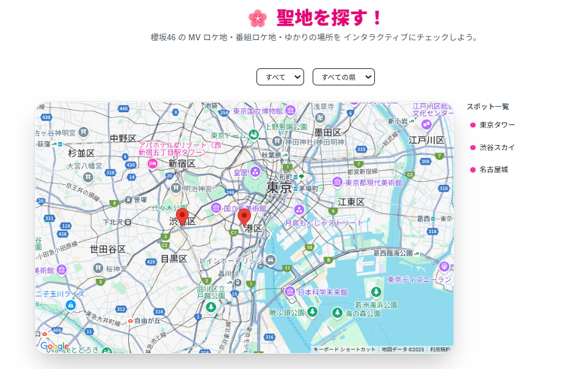

# 🌸 櫻坂46ファンサイト

このプロジェクトは、櫻坂46の非公式ファンサイトです。
MV情報やフォーメーション配置、メンバー紹介、聖地マップなど、ファンが楽しめる情報を整理し、Web上で視覚的に分かりやすく提供しています。

---

## 🔍 主な機能

| 機能カテゴリ          | 説明                                                               |
| --------------- | ---------------------------------------------------------------- |
| 🎵 MVランキング      | YouTube APIを使って最新の再生数を取得し、MVを人気順に表示します。                          |
| 🧩 フォーメーション予想   | 楽曲ごとのポジション配置を、ドラッグ＆ドロップで自由にシミュレートできます。                           |
| 🗺 聖地巡礼マップ      | MVや番組のロケ地を地図上で可視化しています（Google Maps API または react-simple-maps使用）。 |
| 🧑‍🤝‍🧑 メンバー名鑑 | 期生別やペンライトカラー別などで絞り込み可能なプロフィール表示が可能です。                            |

---

## 💪 使用技術

* **Next.js**（App Routerベース）
* **TypeScript**
* **Tailwind CSS**
* **YouTube Data API v3**
* **shadcn/ui**（UIコンポーネント）
* **React Context API / 状態管理（useState / useReducer）**

---

## 📅 注意事項

このサイトは非公式のファンプロジェクトです。
画像や情報などの著作権は櫻坂46およびその関係団体に帰属します。
本プロジェクトは教育・個人の学習目的で作成しており、営利利用は一切行っていません。

---

## 👤 制作：Naoya Nakagawa

* 📧 Email: [nakagawa.naoya.xr@gmail.com](mailto:nakagawa.naoya.xr@gmail.com)
* 🧑‍💻 GitHub: [@NaoyaNakagawa0124](https://github.com/NaoyaNakagawa0124)

---

## 🖼 サンプル画像

### メインページ

### MVランキングページ

### フォーメーション予想ツール

### 聖地巡礼マップ

> 📁 画像ファイルは `/public/images/` に保存してください。
> Markdownでは `/images/ファイル名.png` の形式で使用可能です。